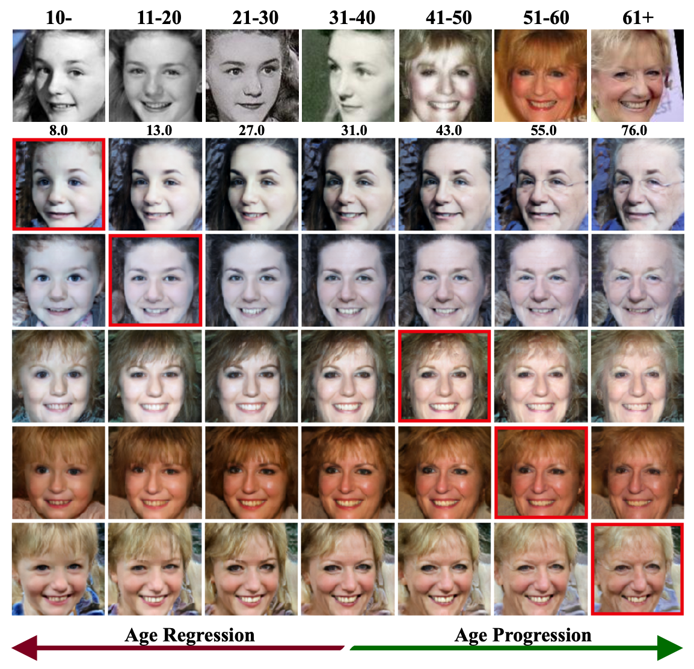
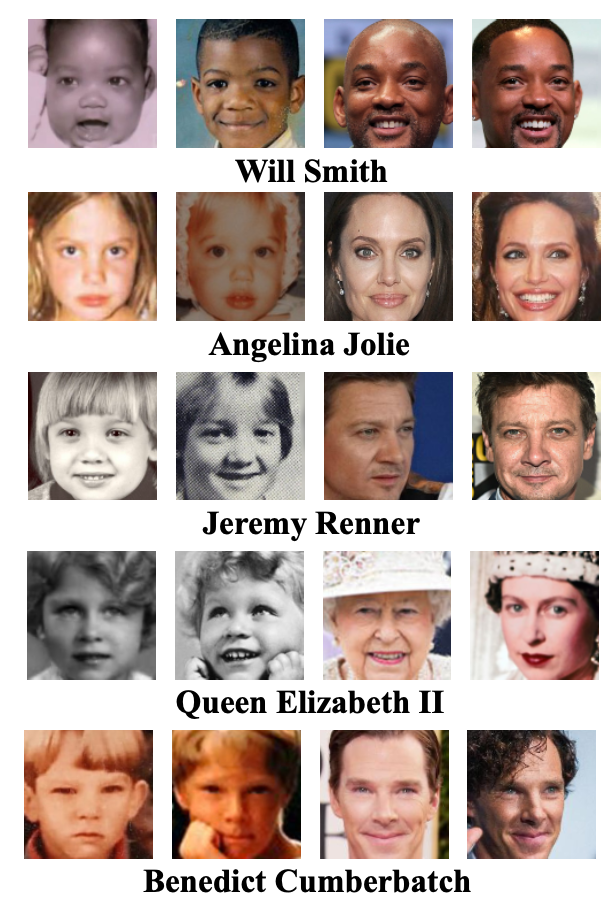

## When Age-Invariant Face Recognition Meets Face Age Synthesis: A Multi-Task Learning Framework and A New Benchmark (TPAMI 2022)
> https://arxiv.org/abs/2210.09835 
<a href="https://mp.weixin.qq.com/s/ZmoHa_ImfyAAycjXIQYjSQ">[Chinese Blog]</a> <br>
> To minimize the impact of age variation on face recognition, age-invariant face recognition (AIFR) extracts identity-related discriminative features by minimizing the correlation between identity- and age-related features while face age synthesis (FAS) eliminates age variation by converting the faces in different age groups to the same group. However, AIFR lacks visual results for model interpretation and FAS compromises downstream recognition due to artifacts. Therefore, we propose a unified, multi-task framework to jointly handle these two tasks, termed MTLFace, which can learn the age-invariant identity-related representation for face recognition while achieving pleasing face synthesis for model interpretation. Specifically, we propose an attention-based feature decomposition to decompose the mixed face features into two uncorrelated components—identity- and age-related features—in a spatially constrained way. Unlike the conventional one-hot encoding that achieves group-level FAS, we propose a novel identity conditional module to achieve identity-level FAS, which can improve the age smoothness of synthesized faces through a weight-sharing strategy. Benefiting from the proposed multi-task framework, we then leverage those high-quality synthesized faces from FAS to further boost AIFR via a novel selective fine-tuning strategy. Furthermore, to advance both AIFR and FAS, we collect and release a large cross-age face dataset with age and gender annotations, and a new benchmark specifically designed for tracing long-missing children. Extensive experimental results on five benchmark cross-age datasets demonstrate that MTLFace yields superior performance than state-of-the-art methods for both AIFR and FAS. We further validate MTLFace on two popular general face recognition datasets, obtaining competitive performance on face recognition in the wild.


### Demo
see notebook [](https://colab.research.google.com/github/Hzzone/MTLFace/blob/master/python_package/notebook/example.ipynb)



### Download

* The pretrained models are available at Google Drive https://drive.google.com/file/d/1OmfAjP3BAqVxaQ2pwyJuOYUHy_incMNd/view?usp=share_link and BaiduDisk https://pan.baidu.com/s/1GT95OPNR-7GQPMSFFVqzeQ?pwd=wizs

* The SCAF dataset can be downloaded from Dropbox https://www.dropbox.com/s/o7zbnzlkpwczbg2/small.txt?dl=0

* The ECAF dataset can be downloaded from Google Drive https://drive.google.com/file/d/1t5O3qbkXi-nD6lQjSHMTeMS2Elp0qUi1/view?usp=share_link and BaiduDisk https://pan.baidu.com/s/1YHLRba_rLd70l3bJE-bIFg?pwd=7a2s

The ECAF dataset is organized as follows:
1. `image_data/img_ffhq` and `image_data/img_mtcnn` are faces aligned by different key points such as FFHQ and MTCNN. Note that a few faces (~10) are not detected and are manually corrected by us.
2. `image_data/data.json` contains the information of each image, including the source url, image url, and the attributes estimated by Face++ API.
3. `image_pairs/*.txt` is the pairs used in the paper, following the LFW dataset.
4. `source_code` contains the benchmarking, aligning code, etc.



## Citation

If you found this code or our work useful please cite us:

```
@inproceedings{huang2021age,
  title={When age-invariant face recognition meets face age synthesis: A multi-task learning framework},
  author={Huang, Zhizhong and Zhang, Junping and Shan, Hongming},
  booktitle={Proceedings of the IEEE/CVF Conference on Computer Vision and Pattern Recognition},
  pages={7282--7291},
  year={2021}
}

@article{huang2022age,
  title={When Age-Invariant Face Recognition Meets Face Age Synthesis: A Multi-Task Learning Framework and A New Benchmark},
  author={Huang, Zhizhong and Zhang, Junping and Shan, Hongming},
  journal={IEEE Transactions on Pattern Analysis and Machine Intelligence},
  year={2022},
  publisher={IEEE}
}
```
